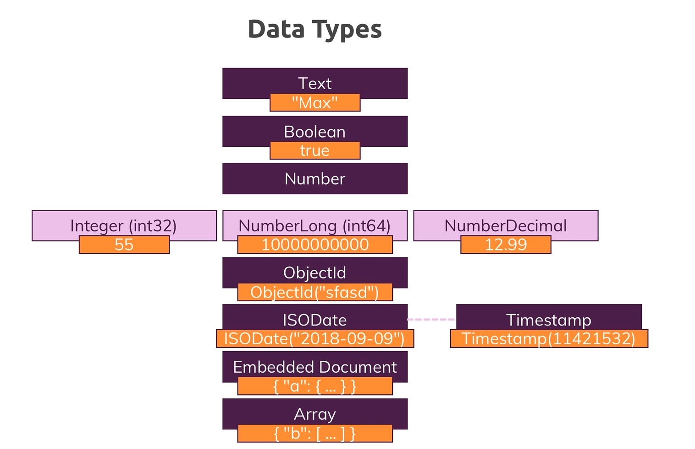

## انواع داده‌ها در MongoDB

در MongoDB، اسناد (Document) از مجموعه‌ای از فیلدها (Field) تشکیل شده‌اند. هر فیلد یک جفت کلید-مقدار (Key-Value Pair)
است که یک کلید منحصر به فرد (مانند نام یا شناسه) و یک مقدار برای آن کلید را مشخص می‌کند. اما این مقادیر می‌توانند از
انواع داده‌ای (Data Type) مختلفی باشند. درک انواع داده‌های پشتیبانی شده توسط MongoDB برای انتخاب نوع مناسب برای هر فیلد
در اسناد، بسیار مهم است.

## انواع اصلی داده‌ها در MongoDB

  برخی از مهم‌ترین آنها عبارتند از:

* **String (رشته):** برای ذخیره‌سازی متن (Text) استفاده می‌شود. این نوع داده برای فیلدهایی مانند نام، عنوان، توضیحات و
  هر نوع داده متنی دیگر مناسب است.

* **Number (عدد):** برای ذخیره‌سازی اعداد صحیح (Integer) و اعداد اعشاری (Double) استفاده می‌شود. این نوع داده برای
  فیلدهایی مانند سن، قیمت، امتیاز و هر نوع داده عددی دیگر مناسب است.

* **Boolean (بولین):** برای ذخیره‌سازی مقادیر درست (true) یا نادرست (false) استفاده می‌شود. این نوع داده برای فیلدهایی
  مانند وضعیت فعال/غیرفعال (active/inactive)، تکمیل شده/نشده (completed/not completed) و هر نوع فیلدی که تنها دو حالت
  دارد، کاربردی است.

* **Array (آرایه):** برای ذخیره‌سازی لیستی از مقادیر همگن یا ناهمگن استفاده می‌شود. آرایه‌ها برای مدل‌سازی روابط یک به
  چند (One-to-Many) و لیست کردن موارد مرتبط با یک سند، مناسب هستند.

* **Object ID (شناسه شیء):** نوع خاصی از داده است که MongoDB به طور خودکار برای هر سند جدید، یک شناسه منحصر به فرد (
  UUID) ایجاد می‌کند. این شناسه کلید اصلی (Primary Key) سند به شمار می‌رود و برای بازیابی و مدیریت اسناد در کلکسیون مورد
  استفاده قرار می‌گیرد.

* **Date (تاریخ):** برای ذخیره‌سازی تاریخ و زمان به صورت میلی‌ثانیه از زمان epoch (نقطه‌آغاز شمارش زمان در سیستم‌های
  کامپیوتری) استفاده می‌شود. این نوع داده برای فیلدهایی مانند تاریخ ایجاد، تاریخ به‌روزرسانی و هر نوع داده زمانی دیگر،
  کاربردی است.

* **Timestamp (تمگا):** نوع خاصی از داده است که نشان دهنده یک زمان خاص با دقت بالا (نانوثانیه) است. Timestamp‌ها عمدتا
  برای عملیات داخلی MongoDB استفاده می‌شوند.

* **Null (تهی):** برای نشان دادن اینکه یک فیلد در یک سند خاص، هیچ مقداری ندارد، استفاده می‌شود.

## انتخاب نوع داده مناسب

انتخاب نوع داده مناسب برای هر فیلد در اسناد، بر کارایی پرس و جو (Query Performance) و مدیریت داده‌ها در MongoDB تأثیر
می‌گذارد. در اینجا به چند نکته برای انتخاب نوع داده مناسب اشاره می‌کنیم:

* برای داده‌های متنی از String استفاده کنید.
* برای اعداد صحیح و اعشاری از Number استفاده کنید.
* برای مقادیر درست/نادرست از Boolean استفاده کنید.
* برای لیست‌کردن موارد مرتبط از Array استفاده کنید

.

* برای شناسه‌های منحصر به فرد از Object ID (به صورت خودکار ایجاد می‌شود) استفاده کنید.
* برای ذخیره‌سازی تاریخ و زمان از Date استفاده کنید.
* برای فیلدهایی که ممکن است فاقد مقدار باشند از Null استفاده کنید.

## مثال برای انواع داده‌ها در MongoDB

همانطور که در بخش قبلی اشاره شد، MongoDB از انواع مختلفی از داده‌ها پشتیبانی می‌کند. در اینجا برای هر نوع داده، مثالی از
نحوه استفاده آن در یک سند آورده شده است:

**1. String (رشته):**

```javascript
db.users.insert({
  "name": "مرجان حسینی",  // String
  "age": 30,
  "email": "marjan.hosseini@example.com"
})
```

در این مثال، فیلد `name` از نوع String برای ذخیره‌سازی نام کاربر استفاده شده است.

**2. Number (عدد):**

```javascript
db.products.insert({
  "name": "توپ فوتبال",
  "price": 120000,  // Number (Integer)
  "quantity": 5
})
```

در این مثال، فیلد `price` از نوع Number برای ذخیره‌سازی قیمت محصول (عدد صحیح) و فیلد `quantity` نیز از نوع Number برای
تعداد موجودی محصول استفاده شده است.

**3. Boolean (بولین):**

```javascript
db.tasks.insert({
  "title": "نوشتن گزارش",
  "completed": true,  // Boolean
  "dueDate": ISODate("2024-03-20T00:00:00Z")
})
```

در این مثال، فیلد `completed` از نوع Boolean برای نشان دادن وضعیت تکمیل شدن تسک (true به معنی انجام شده) استفاده شده
است.

**4. Array (آرایه):**

```javascript
db.users.insert({
  "name": "علی رضوی",
  "skills": [  // Array
    "برنامه نویسی جاوااسکریپت",
    "طراحی وب",
    "سیستم های پایگاه داده"
  ]
})
```

در این مثال، فیلد `skills` از نوع Array برای لیست کردن مهارت‌های کاربر استفاده شده است.

**5. Object ID (شناسه شیء):**

```javascript
// Object ID به صورت خودکار توسط MongoDB برای هر سند جدید ایجاد می‌شود
// برای بازیابی سند با Object ID خاص می‌توانید از دستور زیر استفاده کنید:

db.users.find({ "_id": ObjectId("63cab8c7e4b021d2a7f78b12") })
```

در این مثال، فیلد `_id` از نوع Object ID بوده و به صورت خودکار برای سند کاربر ایجاد شده است. برای بازیابی این سند خاص،
می‌توانید از شناسه شیء آن در دستور `find` استفاده کنید.

**6. Date (تاریخ):**

```javascript
db.events.insert({
  "title": "کنفرانس توسعه دهندگان",
  "startDate": ISODate("2024-04-10T09:00:00Z"),  // Date
  "endDate": ISODate("2024-04-11T18:00:00Z")
})
```

در این مثال، فیلدهای `startDate` و `endDate` از نوع Date برای ذخیره‌سازی تاریخ و زمان شروع و پایان رویداد به
صورت `ISODate` استفاده شده است.

**7. Null (تهی):**

```javascript
db.products.insert({
  "name": "هدفون",
  "price": 85000,
  "discount": null  // Null
})
```

در این مثال، فیلد `discount` از نوع Null است، زیرا در حال حاضر هیچ تخفیفی برای محصول در نظر گرفته نشده است.



## نتیجه‌گیری

این مثال‌ها نحوه استفاده از انواع مختلف داده‌ها را به نمایش می‌گذارد. انتخاب نوع داده مناسب برای هر فیلد، به ماهیت داده
و نیازمندی‌های برنامه شما بستگی دارد.

درک و انتخاب مناسب انواع داده‌ها در MongoDB، یک جنبه مهم در ساختاردهی موثر اسناد و مدیریت بهینه داده‌ها به شمار می‌رود.
با انتخاب نوع داده مناسب برای هر فیلد، می‌توانید کارایی پرس و ج

وها را بهبود بخشیده و فضای ذخیره‌سازی را بهینه‌سازی کنید.
